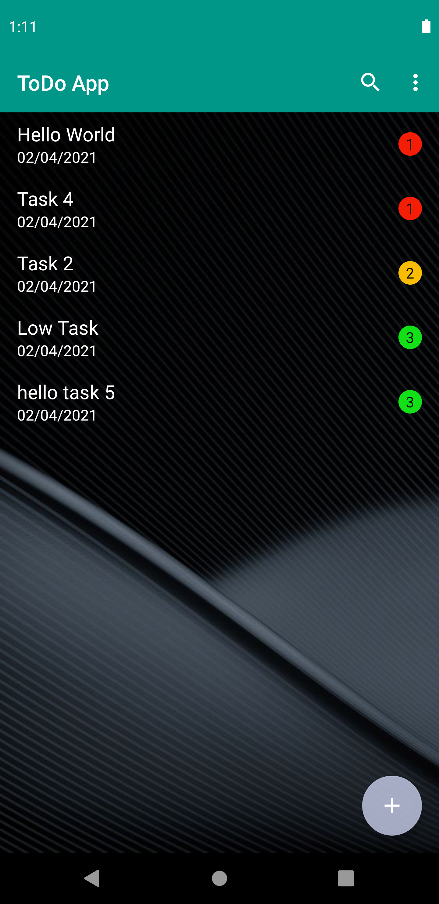

# TODO-LIST-APP

1. Register/ Sign Up: Fill the Required Information and Sign Up.
2. Login: After Signing Up Login with the same credentials.
3. Todo List: Click on the floating Add icon and create the Todo List
4. Todo Item: After creating a Todo List ,Now click on the list and create your Todo Items.
5. Editing the Todo Items: Click on the Todo Item and edit it.
6. Deleting the todo items and list: Swipe to delete entry.
7. Searching Todo items: Search the todo items.

# App_screenshots
| Splash  | Login | Registration |
| ------------- | ------------- |------------- |
|  |   |   |

| Main Activity  | Add Tasks with Priority | List Tasks |
| ------------- | ------------- |------------- |
|  |   |   |

| Saved Tasks  | Updating Tasks | Updated task List |
| ------------- | ------------- |------------- |
|  |   |   |

| Delete All Task  | Delete |
| ------------- | ------------- |
|  |   | 

| Search Specific Task  | Validation |
| ------------- | ------------- | 
|  |    |

| GIF Voice Recognition  | GIF For Swipe to Delete | 
| ------------- | ------------- |
|  |   |

